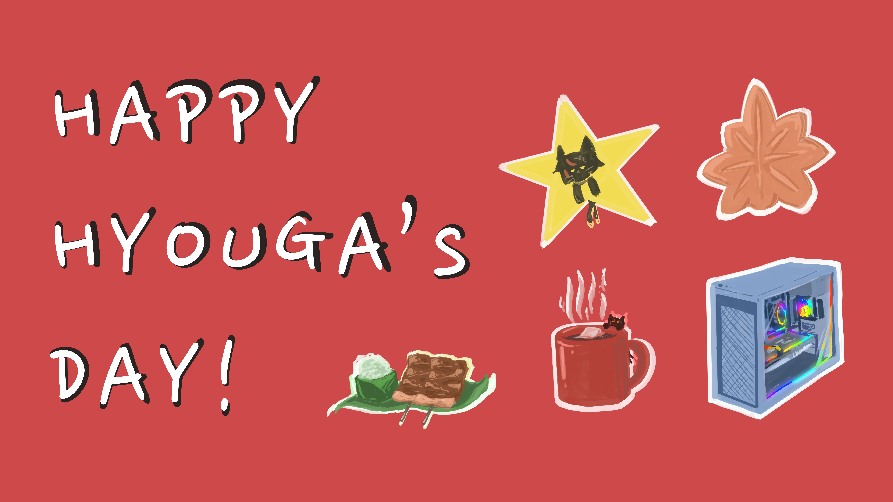

# HyougaAlpha Birthday 2024 : Website Project
adapt from https://github.com/RikiNozomu/baku-bd-static-2023
<!--  -->

Website for posting a wish well to [HyougaAlpha](https://www.youtube.com/@HyougaAlpha_ARP "HyougaAlpha"), Thai Vtirtual Youtuber from [Algorhythm Project](https://algorhythm.realic.net/ "Algorhythm Project")


Production Website : [https://hyouga-birthday-2024.circusnexuscarnival.live/](https://hyouga-birthday-2024.circusnexuscarnival.live/)

## Getting Started

First, run the development server:

```bash
npm run dev
# or
yarn dev
# or
pnpm dev
```

Open [http://localhost:3000](http://localhost:3000) with your browser to see the result.

## Learn More

To learn more about Next.js, take a look at the following resources:

- [Next.js Documentation](https://nextjs.org/docs) - learn about Next.js features and API.
- [Learn Next.js](https://nextjs.org/learn) - an interactive Next.js tutorial.

## Special thanks

- [Original Project](https://github.com/RikiNozomu/baku-bd-static-2023)
- Emotional support - Hyougabyte


## Major Change
### Banner
 - data: src\pages\index.tsx line:59
 - images: public\img\banner

### Countdown
 - function: src\pages\index.tsx line:142
 - container: src\pages\index.tsx line:410

### Postcard's Decoration
 - card bg: 
    - src\svg\badge\top
    - src\svg\badge\body.tsx
    - src\svg\badge\bottom
 - top-left images: public\img\Sticker
 - bottom-right images: public\img\Bottom number

### All CSS
 - all inside: src\styles\globals.css

### Postcard
 - read/write in file: public\post.json
 - data format: src\pages\index.tsx line:292
 - handleSubmit function: src\pages\index.tsx line:205
 - postcards container: src\pages\index.tsx line:551

### Other Important Information
 - website title: src\pages\app.tsx line:45
 - website icon: public\favicon.ico
 - variable declaration: src\pages\index.tsx line:35 
 - gift variable: src\pages\index.tsx line:226
 - writing button: src\pages\index.tsx line:433
